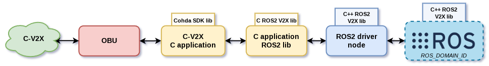

# OBU ROS DRIVER

<div align="center">

[](https://www.linux.org/) [](https://docs.ros.org/en/humble/index.html)  


</div>

---

Use `--recursive` to clone this repository.

```shell
git clone --recursive git@github.com:LMA-FEM-UNICAMP/obu-ros-driver.git
```

## Package Details

### Architecture

<div align="center">


</div>

### Data pipeline

<div align="center">



</div>
## V2X messages library

Size of CAM message (`v2x_msgs__msg__CAM` [1]): **752 bytes**.

## References

[1] ROS2 V2X Library: ROS2 library for ETSI V2X messages. Available at [github.com/virtual-vehicle/v2x_msgs](https://github.com/virtual-vehicle/v2x_msgs).